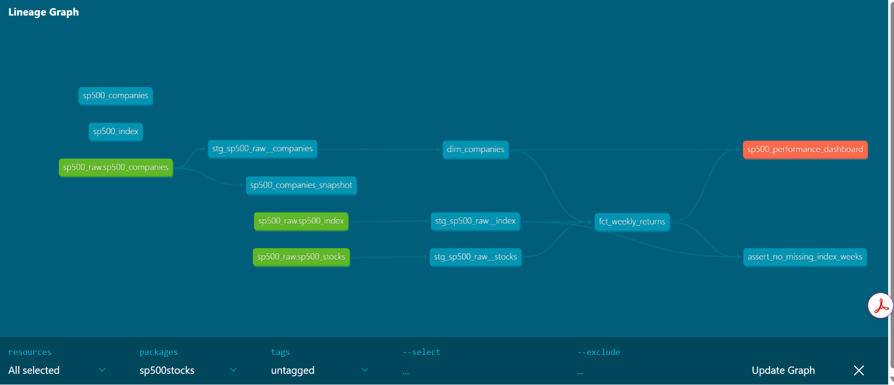

# dbt S&P 500 Financial Pipeline

A production-style dbt project that transforms raw S&P 500 stock and company data into analytics-ready models on Databricks. Built to demonstrate dimensional modelling, incremental loading, SCD Type 2 snapshots, custom Jinja macros, and data quality testing.

---

## Lineage Graph



**Sources → Staging → Marts → Exposure**

- 3 raw sources: `sp500_companies`, `sp500_stocks`, `sp500_index`
- 3 staging models: `stg_sp500_raw__companies`, `stg_sp500_raw__stocks`, `stg_sp500_raw__index`
- 1 snapshot: `sp500_companies_snapshot`
- 2 mart models: `dim_companies`, `fct_weekly_returns`
- 1 singular test: `assert_no_missing_index_weeks`
- 1 exposure: `sp500_performance_dashboard`

---

## Tech Stack

| Tool | Purpose |
|---|---|
| dbt Core | Transformations, testing, documentation |
| Databricks | Compute and Delta Lake storage |
| Delta Lake | Incremental materialisation and ACID guarantees |
| dbt_utils | Surrogate keys, accepted range tests |
| GitHub Actions | CI/CD (planned) |

---

## Project Structure

```
sp500stocks/
├── macros/
│   ├── generate_schema_name.sql   # Dev/prod schema separation
│   ├── marketcap_bucket.sql       # Market cap classification macro
│   ├── rolling_avg.sql            # Parameterised rolling average macro
│   └── volatility.sql             # Annualised volatility macro
├── models/
│   ├── staging/
│   │   ├── stg_sp500_raw__companies.sql
│   │   ├── stg_sp500_raw__stocks.sql
│   │   └── stg_sp500_raw__index.sql
│   └── marts/
│       ├── dim_companies.sql
│       ├── fct_weekly_returns.sql
│       └── exposures.yml
├── snapshots/
│   └── sp500_companies_snapshot.sql
├── seeds/
│   ├── sp500_companies.csv
│   └── sp500_stocks.csv
└── tests/
    └── assert_no_missing_index_weeks.sql
```

---

## Key Features

### Incremental Model — `fct_weekly_returns`
Aggregates daily stock prices into weekly returns using a merge strategy. Uses window functions to calculate week opening and closing prices, then computes weekly return as:

```sql
(week_closing_price - week_opening_price) / week_opening_price * 100
```

Incremental watermark is `stock_week_start_date` — only new weeks are processed on each run.

### SCD Type 2 Snapshot — `sp500_companies_snapshot`
Tracks changes to company attributes (sector, industry, market cap) using dbt's check strategy. Any change to a tracked column creates a new snapshot row with `dbt_valid_from` and `dbt_valid_to` timestamps.

### Custom Jinja Macros

**`marketcap_bucket(market_cap)`** — classifies companies into `mega_cap`, `large_cap`, `big_cap`, `super_mega_cap` based on market capitalisation thresholds.

**`rolling_avg(column_name, partition_by, order_by, window_size)`** — reusable parameterised rolling average using SQL window functions. Applied in `fct_weekly_returns` as a 4-week rolling average of closing price.

**`calc_volatility(price_col, ticker_col, date_col, window_rows)`** — calculates annualised volatility using log returns and a rolling standard deviation window, scaled by `SQRT(52)` for weekly data.

```sql
STDDEV(LN(price / LAG(price))) OVER (...) * SQRT(52)
```

### Data Quality Testing
- **67 tests total — 0 failures, 0 warnings**
- Generic tests: `not_null`, `unique`, `accepted_values`, `relationships`, `dbt_utils.accepted_range`
- Singular test: `assert_no_missing_index_weeks` — verifies every week in `fct_weekly_returns` has a matching index entry via a left join check

---

## Schema Convention

| Layer | Schema |
|---|---|
| Raw (seeds) | `sp500_dev_raw` |
| Staging | `sp500_dev_stg` |
| Marts | `sp500_dev_marts` |
| Snapshots | `sp500_dev_snapshot` |

Schema separation between dev and prod is handled by the `generate_schema_name` macro.

---

## How to Run

### Prerequisites
- dbt Core installed
- Databricks workspace access
- `profiles.yml` configured at `~/.dbt/profiles.yml`

### Setup

```bash
# Clone the repo
git clone https://github.com/nmacharla889/dbt_sp500_stocks.git
cd dbt_sp500_stocks

# Activate virtual environment
python -m venv dbt-env
source dbt-env/bin/activate  # Windows: dbt-env\Scripts\Activate.ps1

# Install dependencies
pip install dbt-databricks
dbt deps
```

### Run

```bash
# Load seed data
dbt seed

# Run all models
dbt run

# Run snapshot
dbt snapshot

# Run tests
dbt test

# Full build (seed + run + snapshot + test)
dbt build

# Generate and serve docs
dbt docs generate
dbt docs serve
```

### Incremental vs Full Refresh

```bash
# Incremental run (default — processes new weeks only)
dbt run --select fct_weekly_returns

# Full refresh (reprocesses all historical data)
dbt run --select fct_weekly_returns --full-refresh
```

---

## Interview Talking Points

- **Incremental strategy**: merge on `weekly_return_key` (surrogate key from week + ticker). Watermark on `stock_week_start_date` to process only new weeks.
- **Snapshot strategy**: check strategy tracks company attribute changes — different from timestamp strategy used in Project 1 (Olist).
- **Macro reusability**: `rolling_avg` and `calc_volatility` are parameterised — not hardcoded to this model. Can be reused across any model with the right column inputs.
- **Volatility calculation**: log returns are used instead of percentage returns because they are additive over time — standard in quantitative finance.
- **Singular test design**: `assert_no_missing_index_weeks` uses a left join to detect referential gaps that a generic `relationships` test cannot catch post-aggregation.
- **Production path**: local dbt Core → GitHub → in production this pipeline would run on dbt Cloud or Airflow triggering dbt jobs, with Databricks as the compute layer.

---

## Data Source

[Kaggle — S&P 500 Stocks Dataset](https://www.kaggle.com/datasets/joebeachcapital/s-and-p500-index-stocks-daily-updated)

Historical daily prices and company metadata for S&P 500 constituents from 2010 to 2024.